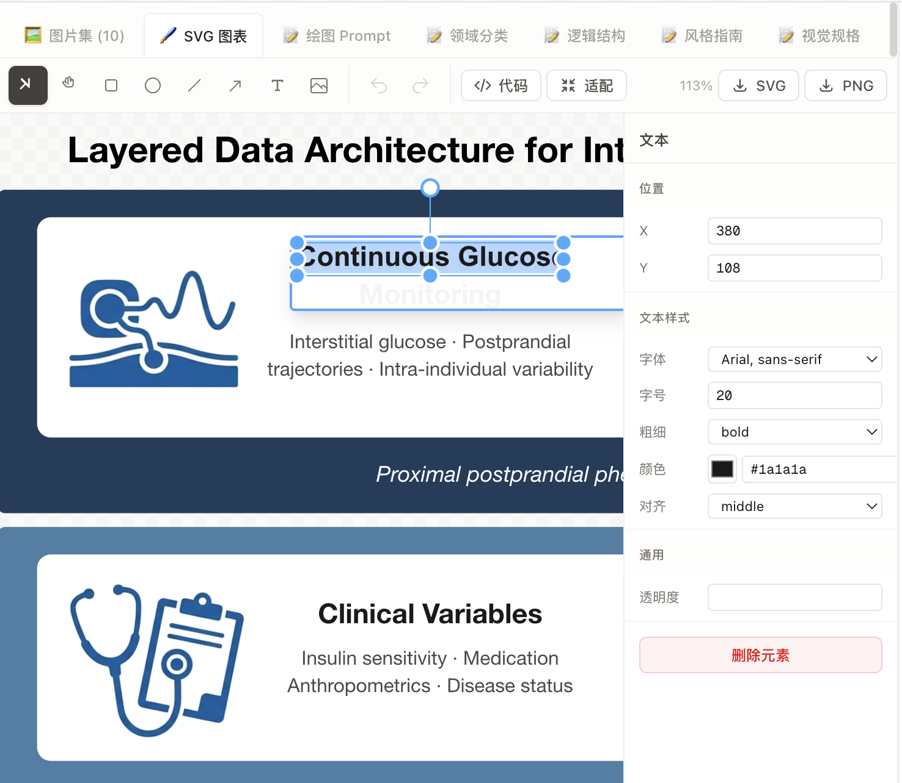
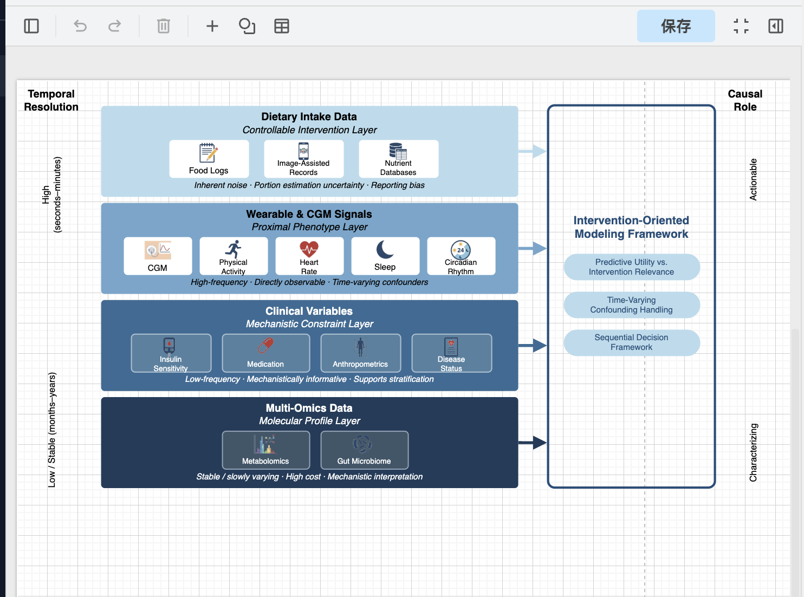

# Pegasus

[English](README.en.md) | 中文

**AI 科研绘图 Agent** — 全自动、可自我审查、支持持续交互改进的科研论文配图生成与精准编辑系统。

Pegasus 能够根据用户的文字描述或论文内容，自动完成从内容分析、风格提取、图表生成到可编辑 Draw.io XML 输出的完整流程。它不只是一个「画图工具」，而是一个具备自主判断能力的 Agent —— 能理解学术语境、遵循顶会视觉规范、主动审核生成质量、并与用户持续对话优化结果。


---

## 核心特性

- **全自动工作流** — 从输入分析到最终出图，7 步流程全自动执行，无需手动干预
- **多学科适配** — 内置计算机科学、生物学、经济学等领域的视觉规范 Skill，自动匹配目标会议/期刊风格
- **自我审查机制** — 生成图表后通过视觉模型对比原图审核一致性，发现问题自动修正
- **交互式编辑器** — 内置 Draw.io 编辑器，支持拖拽、连线、样式编辑，所见即所得
- **持续对话改进** — Agent 主动提问确认需求，用户可随时要求调整颜色、布局、箭头样式等细节
- **Icon 智能提取** — 自动从生成图中提取 icon 元素，去除背景后嵌入 Draw.io XML，实现可编辑图表
- **多格式导出** — 支持 Draw.io XML 导出

---

## 界面预览

| 创作界面 | 编辑器 |
|---------|--------|
|  |  |


---

## 高保真 Draw.io 图表还原

Pegasus 生成的可编辑 Draw.io XML 与 AI 原始生成图具有极高的视觉一致性。通过逆向工程 + 视觉审核 + 自动修正的流水线，Draw.io 版本在布局、配色、箭头、文字等细节上精确还原原图，同时每个元素都可独立编辑。

| AI 生成原图 | Draw.io 可编辑版本 |
|------------|-------------------|
|  |  |

---

## 工作流程

Pegasus 的核心绘图流程分为 7 个步骤：

```
用户输入 → Step 1: 分析输入（领域分类）
         → Step 2: 提取视觉风格（匹配目标会议）
         → Step 3: 梳理逻辑结构
         → Step 4: 生成视觉规格书
         → Step 5: 编写绘图 Prompt
         → Step 6: 生成图片（Gemini）
         → Step 7: Icon 提取 + Draw.io XML 逆向 + 视觉审核 + 组装
                   → 可编辑 Draw.io XML 输出
```

### Step 7 详细流程（Draw.io XML 合成）

```
原图 ──→ 生成 icons-only 版本
     ──→ 去除白色背景
     ──→ 检测 icon 区域（bbox）
     ──→ 裁切单个 icon
     ──→ 逆向原图为 Draw.io XML 模板（AnalyzeImage + Gemini）
     ──→ 视觉一致性审核
     ──→ 组装最终 XML（嵌入 icon data URI）
```

---

## 快速开始

### 环境要求

- **Node.js** >= 18
- **MongoDB** >= 6.0（本地运行或云服务）
- **OpenRouter API Key**（用于调用 LLM 和图像生成模型）

### 安装

```bash
git clone https://github.com/HANsoA-KevinO/pegasus.git
cd pegasus
npm install
```

### 配置环境变量

```bash
cp .env.local.example .env.local
```

编辑 `.env.local`：

```env
OPENROUTER_API_KEY=your-openrouter-api-key
MONGODB_URI=mongodb://localhost:27017/pegasus
```

### 启动开发服务器

```bash
npm run dev
```

访问 [http://localhost:3000](http://localhost:3000)

---

## 功能详解

### 虚拟工作区

每个对话拥有独立的虚拟工作区，所有中间产物和最终成果持久化存储在 MongoDB 中。Agent 通过 `Read`/`Write`/`Edit` 工具在工作区内操作文件，工作流每一步的结果即时写入对应文件，用户可随时在右侧面板查看和编辑。

```
workspace/
├── input/user-content.md          # 用户原始输入
├── analysis/
│   ├── domain-classification.md   # 领域分类
│   ├── logic-structure.md         # 逻辑结构
│   ├── style-guide.md             # 视觉风格指南
│   └── visual-spec.md             # 视觉规格书
├── output/
│   ├── draw-prompt.md             # 英文绘图 Prompt
│   ├── image.png                  # 生成的图片
│   ├── diagram.xml                # Draw.io 可编辑图表
│   └── icons/                     # 提取的 icon 素材
└── settings/config.md             # 目标会议、图片尺寸等配置
```

工作区面板支持多标签切换（图片、画廊、Draw.io 编辑器、Markdown、代码），Agent 生成新内容时自动切换到对应标签。

### 快速引用编辑

用户可以在工作区面板中**选中任意文本内容**（分析文档、XML 代码、配置文件等），选中内容会自动附加到下一条聊天消息中作为上下文引用。Agent 能准确理解用户指向的内容并做出针对性修改。

例如：选中 XML 代码中的一段 mxCell → 输入「把这个箭头改成虚线」→ Agent 精确定位并修改对应元素。

### 跨对话持久记忆

Pegasus 具备全局记忆系统，自动从对话中提取有价值的信息并持久化存储，跨对话生效：

| 记忆类型 | 说明 |
|---------|------|
| **用户偏好** | 角色、专业领域、工作习惯、视觉风格偏好 |
| **行为反馈** | 用户对 Agent 行为的纠正或认可，指导后续表现 |
| **项目上下文** | 项目级决策、约定、截止日期等 |
| **外部引用** | 外部系统资源的位置和用途 |

记忆自动提取（每次对话结束后异步执行），自动召回（每次新消息时按相关性匹配），无需用户手动管理。

### 主动交互与决策确认

Agent 不是闷头执行到底 — 它会在关键节点主动暂停并向用户提问：

- 开始前确认需求理解是否正确，提供 2-3 个可选方向
- 遇到歧义时主动询问而非自行假设
- 生成结果后征求反馈意见

用户可以点击预设选项快速回复，也可以输入自定义答案。Agent 收到回复后自动恢复执行。

### 无限上下文

复杂绘图任务可能涉及大量工具调用，轻松超出 LLM 上下文窗口。Pegasus 内置上下文压缩引擎：

- 当对话 token 超过 **140K** 时自动触发压缩
- 生成结构化摘要（用户需求、工作区状态、分析进展、用户偏好）
- 同时快照当前工作区文件内容，确保压缩后不丢失关键信息
- 压缩后约缩减 64% 的 token 占用，Agent 可继续无缝工作
- 前端实时显示上下文使用进度条，黄色/橙色预警

### 多轮图像编辑

图像生成支持多轮对话式修改，无需每次从头描述：

```
第 1 轮：「生成一个 Transformer 架构图」     → image.png
第 2 轮：「去掉所有背景，只保留 icon」        → image_icons_only.png（基于上一轮修改）
第 3 轮：「把颜色改成蓝色系」                → image_v2.png（保持完整上下文）
```

底层通过维护图像生成会话（含历史消息和上一轮图片），让视觉模型理解完整修改链路。

### 自我审查与迭代修正

生成图表后，Agent 自动执行视觉一致性审核：

1. 渲染图表预览图
2. 调用视觉模型对比渲染图与原始生成图
3. 逐项检查箭头、文字、线条、色块、占位符位置
4. 发现问题自动用 `Edit` 工具修正 XML 代码
5. 最多迭代 2 轮，直到审核通过

### Draw.io 交互式编辑器

内置 Draw.io 编辑器，支持对 Agent 生成的图表进行所见即所得的精细调整：

- **拖拽编辑** — 选中节点拖拽移动、调整大小
- **连线编辑** — 箭头、连线样式、路径调整
- **样式面板** — 颜色、字体、边框、填充等属性编辑
- **导出** — XML 代码下载

### 可插拔 Skill 系统

Pegasus 通过 Skill 系统适配不同学科的视觉规范。Agent 自动根据用户输入的内容识别学科领域，加载匹配的 Skill 获取该领域的绘图惯例和风格指南。Skill 可自由扩展 — 添加新的 `lib/skills/<domain>/SKILL.md` 即可支持更多学科。

---

## 项目结构

```
pegasus/
├── app/                    # Next.js App Router
│   ├── api/                # API 路由（chat, conversations, models）
│   ├── layout.tsx          # 根布局
│   └── page.tsx            # 主页面
├── components/             # React 组件
│   ├── chat/               # 对话界面（输入、消息、新建任务表单）
│   ├── sidebar/            # 侧边栏（历史对话、模型选择）
│   └── workspace/          # 工作区面板
│       ├── DrawioEditor.tsx # Draw.io 编辑器
│       ├── ImageGallery.tsx # 多图画廊
│       └── WorkspacePanel.tsx
├── hooks/                  # React Hooks
├── lib/
│   ├── agent/              # Agent 核心（循环、Provider、上下文压缩）
│   ├── db/                 # MongoDB 模型与数据访问
│   ├── skills/             # 领域 Skill 定义
│   ├── tools/              # 工具实现与 Schema
│   └── workspace/          # 工作区实例与文件管理
└── public/                 # 静态资源
```

---

## 技术栈

| 层级 | 技术 |
|------|------|
| 框架 | Next.js 16, React 19 |
| 样式 | Tailwind CSS |
| 数据库 | MongoDB (Mongoose 9) |
| LLM | Claude Opus 4.6 via OpenRouter （建议使用模型）|
| 图像生成 | Gemini 3 Pro image preview via OpenRouter |
| 图表编辑 | Draw.io (embed.diagrams.net) |
| 图像处理 | Sharp |

---

## License

MIT

